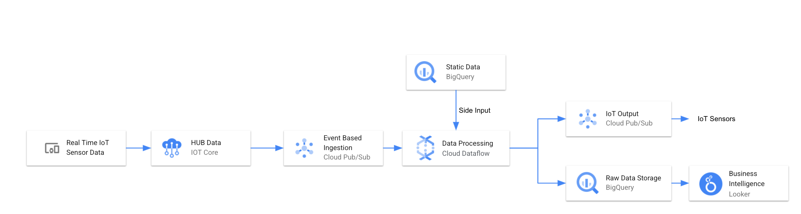

## Google Cloud IoT Core Processing - Streaming Analytics

This is a demo pipeline that showcases the streaming capabilities of Dataflow/Apache Beam. 

### Steps used by the pipeline 
------------------------------
1. IoT device publishes the data to IoT Core using HTTP/MQTT methods (not shown here)
2. Dataflow pipeline (part of this code) ingests the IoT data from PubSub topic linked to the IoT Core
3. The dataflow also utilises the SideInput from a static table in BigQuery to process the incoming data
4. The pipeline persists the entire raw message into the BigQuery data warehouse for further analysis/insights using Looker (not shown here)
5. The pipeline also publishes the messages meeting the criteria into a PubSub topic to be used by the downstream IoT manager to take further actions. 

### Prerequisites to run this demo
TBC

### Usage 
tbc

### Comments
tbc